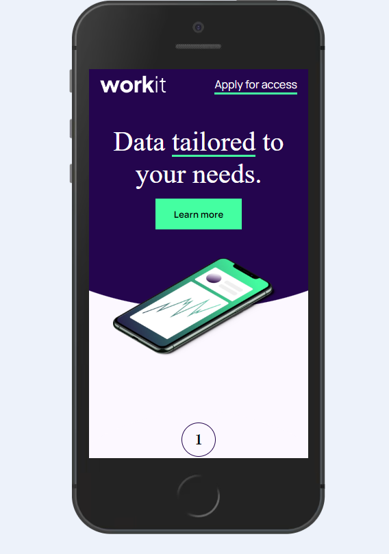
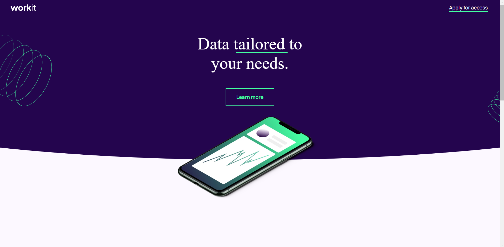

# Frontend Mentor - Workit landing page

This is a solution to the [Social links profile challenge on Frontend Mentor](https://www.frontendmentor.io/challenges/social-links-profile-UG32l9m6dQ). Frontend Mentor challenges help you improve your coding skills by building realistic projects. 

## Table of contents

## Overview

### The challenge

Users should be able to:

- See hover and focus states for all interactive elements on the page

### Screenshot

### Links

- Solution URL: https://www.frontendmentor.io/challenges/workit-landing-page-2fYnyle5lu/hub?share=true
- Live Site URL: https://arekr93.github.io/workit_landingpage/

## My process

### Built with

- Semantic HTML5 markup
- CSS custom properties
- Flexbox
- Mobile-first workflow

### What I learned
Much troubles with responsivities of some elements like patterns on header. Little troubles with desinged header and section (that's curves on belows of sections).

## Author

- Website - work in progress [Arkadiusz Ruszczak](https://www.your-site.com)
- Frontend Mentor - [@ArekR93](https://www.frontendmentor.io/profile/ArekR93)

